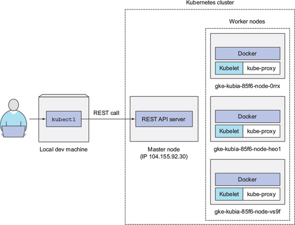

## Setup Kubernetes

- Khi bắt đầu tìm kiếm cách để  cài đặt Kubernetes, bạn sẽ tìm thấy có rất nhiều cách hướng dẫn nhưng không biết phải bắt đầu từ đâu. Vì thê ở chương này tôi sẽ 
hướng dẫn một số  cách cài dặt phổ biến mà chúng ta sẽ dùng trong luyện tập: 

- Trước khi vào phần cài đặt ,chúng ta sẽ cài đặt một công cụ gọi là `kubectl` trước tiên đã. Đây là công cụ cho phép giao tiếp với các node kubernetes thông qua api.

<br>
<p align="center">
  
</p>
<br> 

- bạn có thể  lên [trang chủ](https://kubernetes.io/docs/tasks/tools/install-kubectl/#install-kubectl) cuar kubernetes để  lựa chọn bản `kubectl` phù hợp với hệ điều hành cảu mình.

### Local 

- Ở Local, vâng phải nói đây là môi trường đơn giản nhưng cũng không kém phần phức tạp nhất, bởi vì có rất nhiều cách để  cài đặt và chúng ta không biết phải bắt đầu từ đâu cả. Đừng lo bởi vì ai mới đầu tiếp cận cũng gặp đièu tương tự vậy thôi và cứ dần dần tìm hiểu sẽ vỡ ra.

- Trong môi trường này chúng ta có 2 hình thức phổ biến nhất đó là sử  dụng minikube và kubeadm.

#### Minikube

- phải nói từ khi minikube ra đời giúp cho dev có thể  cài đặt , làm quen và sử  dụng được k8s một cách dễ  dàng hơn nhiều cũng nhưng tránh được nhiều lỗi giao tiếp giữa các service khi cài dặt. Trước đó nếu bạn đã từng tiếp xúc với các bản k8s 1.4.x đổ  về  trước bạn sẽ thấy việc cài đặt k8s khó thể  nào. Thời đó việc cài đặt k8s được thực hiện thông qua dùng một script tạo các node dùng với ảo hóa (virtualization) thông qua `kvm`, `virtualbox` hay `vmware` dùng với `vagrant`. Tuy nhiên việc cài đặt một môi trường từ ảo hóa khá tốn tài nguyên và thời gian bởi vì có rất nhiều nguyên nhân khi cài đặt như network, giao tiếp giữa các node khiến cho việc cài đặt rất mát công và lỗi. Hay nếu không muốn dùng cách này bạn có thể  dùng với docker, thời đó k8s cũng hỗ  việc cài đặt các service bằng docker nhưng cách làm này cũng không thực sự triệt để  bởi vì có một số  lỗi như vấn đề  về  k8s dns, vấn đề  về  giao tiêp với service etcd, etc. Và điều đó khiến tôi thậm chí mất cả ngày chỉ để  sử  lỗi mà không thành công được. 

- Quay trở lại với minikube đây là một công cụ cài đặt tât cả các kubernetes service cần thiét thông qua một máy ảo ( các version gần đây có lựa chọn cho phép bạn cài đặt trực tiếp mà không thông qua máy ảo ). Bạn chỉ cần tải về  và thiết lập các tham số  lựa chọn ( options ) và chạy công cụ này là xong. Khá dễ  dàng phải không, tuy vậy minikube có một hạn chế  đó là môt trường sử  dụng của nó chỉ dùng trong môi trường phát triển ( development ) hay kiểm thử  (testing ) bởi vì nó bị giới hạn một số  tính năng ( load balancer, etc ) và chỉ setup được với một node ( tức là node vừa là master vừa là agent). Do đó tính năng cluster, một trong những tính năng quan trọng sẽ không thể  hiện hiệu được khi sử  dụng minkube. Nhưng dừng lo ,vì hầu hết các tính năng phục vụ phát triển đều triển khai được lên trong quá trình phát triển và kiểm thử  thiếu tính năng cluster cũng không quan trọng cho lắm.

- Trước khi bắt đầu cài đặt minkube bạn cần lưu ý là chúng ta sẽ phải cài đặt một công cụ ảo hóa virtualization trước tiên. Ở đây tôi sẽ chọn virtualbox vì đơn giản nó free và dễ  dang cài đặt thông qua lệnh hay trực tiếp tải file cài đặt trên trang chủ vè và chạy.

- Tiếp theo bạn có thể  lên trang chủ của [minikube](https://github.com/kubernetes/minikube) và lựa chọn cách cài đặt phù hợp với hệ đièu hành của mình. Ở đây tôi xài Linux lên sẽ dùng lệnh:

```bash
curl -Lo minikube https://storage.googleapis.com/minikube/releases/latest/minikube-linux-amd64 && chmod +x minikube && sudo mv minikube /usr/local/bin/
```

- Sau khi đã tải về  thành công, bạn sẽ khởi động minkube bằng lệnh:

```bash
minikube start
```

- `Lưu ý`: minikube cho phép bạn khởi động cùng với nhiều trạng thái khác nhau ví dụ như lựa chọn cấu hình máy ảo uốn sử  dụng, phiên bản k8s, etc. Để  biết thêm chi tiết hay chạy lệnh `minikube --help`.

- Chờ một lúc để  các bước cài đặt thành công, sau đó hãy chạy lệnh:

```sh
kubectl get po

hoặc 

kubectl cluster-info
```

- Nếu sau đó một thông báo 

```sh
No resources found.

hay

Kubernetes master is running at https://192.168.99.100:8443
KubeDNS is running at https://192.168.99.100:8443/api/v1/namespaces/kube-system/services/kube-dns:dns/proxy
```

- Chức mừng bạn vậy đã bạn đã cài đặt k8s thành công.

#### Kubeadm

- Phần trước chúng ta đa tìm hiểu về  cách cài đặt kubernetes thông qua `minikube` rồi tuy nhiên chúng ta cũng thấy hạn chết của `minikube` đó là không hỗ  trợ mô hình cluster. Vì vậy để  giải quyết vấn đề  này và sử  dụng full tính nằng của kubernetes, chúng ta có thể  sử  dụng `kubeadm`.

- Trước khi bắt đầu cài đặt và sử  dụng `kubeadm` cần cài đặt một số  công cụ và lưu ý một số điều sau hay bạn có thể  xem tại [đây](https://kubernetes.io/docs/tasks/tools/install-kubeadm/):

+ như chúng ta biết kubebernetes là một công cụ quản lí container, do đó chúng ta sẽ cần cài đặt một cụ container trước tiên. Ở đây yêu câu trước tiên của chúng ta đó là cài đặt docker.

+ Tiếp đó để  đảm bảo `kubeadm` hoạt động tốt chúng ta cần tắt ( disable ) chức năng swap đi.

- Sau khi đã thực hiện các bước trên chúng ra sẽ bắt đầu đi vào cài đặt `kubeadm`:

##### Debia & Ubuntu


```sh
apt-get update && apt-get install -y apt-transport-https curl
curl -s https://packages.cloud.google.com/apt/doc/apt-key.gpg | apt-key add -
cat <<EOF >/etc/apt/sources.list.d/kubernetes.list
deb http://apt.kubernetes.io/ kubernetes-xenial main
EOF
apt-get update
apt-get install -y kubelet kubeadm kubectl
```

##### Redhat & Centos & Fedora

```sh
cat <<EOF > /etc/yum.repos.d/kubernetes.repo
[kubernetes]
name=Kubernetes
baseurl=https://packages.cloud.google.com/yum/repos/kubernetes-el7-x86_64
enabled=1
gpgcheck=1
repo_gpgcheck=1
gpgkey=https://packages.cloud.google.com/yum/doc/yum-key.gpg https://packages.cloud.google.com/yum/doc/rpm-package-key.gpg
EOF
setenforce 0
yum install -y kubelet kubeadm kubectl
systemctl enable kubelet && systemctl start kubelet
```

- Hãy kiểm tra chắc chắn rằng `kubelet` đã chạy. Nêu mọi thứ đã ổn định hãy chạy lệnh:

```
kubeadm init
```

- Hãy chờ một lúc để  các container images được tải về và start. Sau đó tương tự như phấn trước chúng ta sẽ dùng kubectl để  kiểm tra.

- Lưu ý: Trong trường hợp bạn đợi quá lâu mà `kubeadm` vẫn chưa chạy xong. Khả năng cao là có lỗi xảy ra ở đâu đó rồi. hãy sử  dụng lệnh `journalctl -xe -u kubelet -f` hoặc kiểm tra tại [đây](https://kubernetes.io/docs/setup/independent/troubleshooting-kubeadm/) để  tìm các lỗi tương ứng và khắc phục.

- sau khi khởi tạo thành công một dòng thông báo sẽ hiển thị kèm với một token, hãy ghi nhớ token này vì đây sẽ là chìa khóa để  bạn có thể  tạo ra mô hình cluster giữa các nút với nhau lại. Trong trường hợp bạn không cẩn thận quên, đừng lo lắng bởi vì kubeadmin cũng cung cấp cho ta cách để  sinh lại token này qua lệnh `kubeadm token create` hoặc `kubeadm token generate`.

- sau đó dựa vào token này, trên các node khác ta sử  dung lệnh `kubeadm join --token [token] mastet_ip:6443` để  kết nối tới node master. Sau khi thực hiện kết nối, hãy kiểm tra bằng lệnh `kubectl get nodes` để  kiểm tra những nút đang kết nối với nhau theo mô hình cluster.

### Cloud

- Đối với môi trường Cloud , nếu bạn để  ý trong danh sách các [host, cloud](https://kubernetes.io/docs/setup/pick-right-solution/) được cung cấp, trong đó có 3 môi trường phổ  biến nhất đó là GKE, AWS ( EKS ) và ACS ( Azure Container Service ) 

#### Google Kubernetes Engine  ( GKE )

- Trước khi bắt đầu cài đặt và sử  dụng GKE cần lưu ý một số  điều [sau](https://cloud.google.com/kubernetes-engine/docs/quickstart)


#### Elastic Kubernetes Service ( EKS )

#### Todo